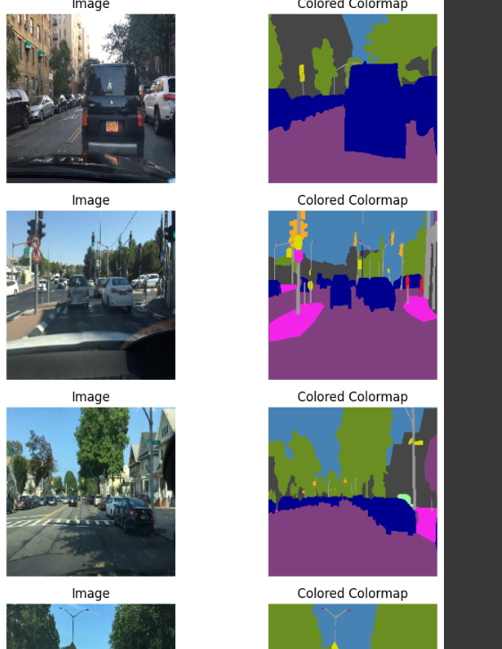

# Autonomous-Driving-Segmentation-ViT-SegFormer

## Autonomous Driving Segmentation Using ViT and SegFormer with Enhanced Attention Mechanisms

This project presents a deep learning approach to segmentation in autonomous driving scenarios using Vision Transformer (ViT) and SegFormer models. With the inclusion of advanced attention mechanisms, the model is designed to handle complex multi-class segmentation tasks within color map data. This project explores the capabilities and limitations of ViT and SegFormer in extracting meaningful features from color-coded maps, providing insights valuable for the fields of computer vision and autonomous driving.

## Project Overview

The primary objective of this project is to evaluate the efficacy of ViT and SegFormer models in segmenting intricate color map data associated with autonomous driving applications. While these models have shown strong performance in other domains like medical imaging, color map segmentation presents unique challenges. The primary focus here is on capturing detailed features necessary for autonomous driving environments, such as lane lines, vehicles, and obstacles.

Despite initial promising results in feature extraction, the limitations of ViT and SegFormer in accurately segmenting color maps highlight the need for further refinement in attention mechanisms and loss functions. This project thus provides a comprehensive study of the challenges and potential solutions for color-based segmentation tasks in real-world applications.

## Key Features

- **ViT Backbone**: Leveraging Vision Transformer (ViT) as a backbone for robust feature extraction, providing high-dimensional representations that are particularly useful in visual tasks.
  
- **SegFormer Decoder**: Integrating SegFormer’s powerful decoder to handle fine segmentation, well-suited for capturing boundaries and details in complex environments.

- **Enhanced Attention Mechanisms**: Incorporating the Convolutional Block Attention Module (CBAM) and Multi-Scale Feature Fusion, which helps to selectively focus on important features within color-coded maps.

- **Custom Loss Functions**: Utilizing a combination of Dice, IoU, Focal, and Boundary loss functions, tailored for improving performance on complex segmentations where traditional loss functions may fall short.

- **Efficient Training Pipeline**: A highly optimized training pipeline that leverages gradient accumulation, mixed precision training with AMP, and gradient clipping to efficiently handle large datasets without compromising model stability.

- **Multi-Scale Feature Fusion**: Enabling feature aggregation from multiple resolutions to better capture both global context and fine details, essential for accurate segmentation in autonomous driving scenarios.

## Model Architecture

### Vision Transformer (ViT)
- Used as the primary feature extractor to provide high-dimensional embeddings.
- Pre-trained weights on ImageNet to accelerate convergence and improve performance on limited datasets.

### SegFormer Decoder with CBAM and Multi-Scale Fusion
- The SegFormer decoder is responsible for transforming feature embeddings into segmentation maps.
- CBAM is applied to focus on the most relevant regions, while multi-scale fusion aggregates information across multiple scales, capturing both local and global details.

### Custom Loss Functions
- **Dice Loss**: Enhances model performance on imbalanced datasets by focusing on pixel overlap.
- **IoU Loss**: Further improves segmentation performance by measuring intersection over union.
- **Focal Loss**: Helps the model learn from hard-to-classify samples, reducing bias towards easy-to-segment regions.
- **Boundary Loss**: Addresses discrepancies along the edges, ensuring more precise boundary segmentation.

## Project Results

After extensive training and evaluation, the model shows promising, yet limited success in segmenting color maps. The unique challenges of color-based segmentation indicate that while ViT and SegFormer are powerful, additional enhancements may be needed to improve their effectiveness for color-coded data in autonomous driving. The project results underscore the importance of custom loss functions and attention mechanisms but also suggest further research opportunities for optimizing these architectures.

### Example Results

Below are some example results from our model:


*Segmentation output showcasing lane and obstacle detection in autonomous driving scenarios.*


*Detailed view of the model’s boundary detection capabilities on color-coded maps.*


*Demonstrating feature extraction effectiveness with multi-scale fusion on autonomous driving data.*


*Illustrating the impact of custom loss functions on the segmentation output.*


*Final evaluation result displaying the segmentation accuracy and feature clarity in complex scenarios.*

## Getting Started

### Prerequisites

Ensure you have the following libraries installed:
- **Python** 3.7+
- **PyTorch**
- **Albumentations**
- **scikit-learn**
- **timm**
- **matplotlib**
- **MONAI** (for Dice and IoU metrics)

### Installation

1. Clone the repository:

    ```bash
    git clone https://github.com/your_username/Autonomous-Driving-Segmentation-ViT-SegFormer.git
    cd Autonomous-Driving-Segmentation-ViT-SegFormer
    ```

2. Install dependencies:

    ```bash
    pip install -r requirements.txt
    ```
